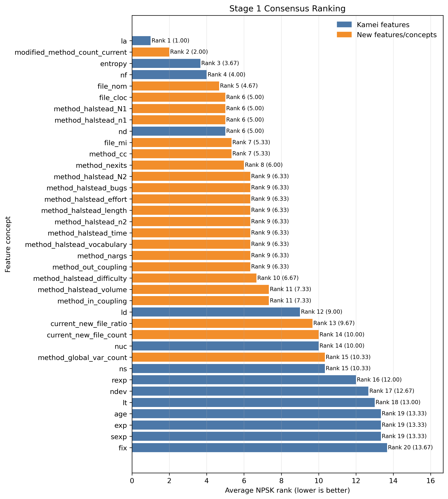
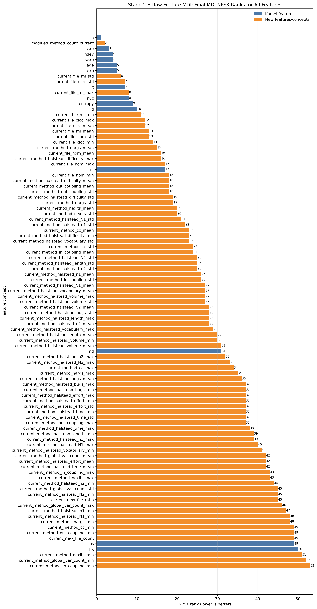

# JIT-SDP Feature Suite
A feature extraction and analysis framework for Just-In-Time Software Defect Prediction (JIT-SDP).

This repository provides an extensible pipeline for extracting commit-level expert features from software repositories and systematically analyzing their importance and predictive contribution. It extends the canonical 14 change metrics proposed by Kamei et al. with method-level and file-level software metrics.


## Overview

This repository contains two main modules:

- `commit_feature_suite`: feature extraction module
- `jit_sdp_experiment_analysis`: feature analysis and experimental evaluation module

## Repo Structure & Description
`stage2.py` corresponds to the experimental results reported in this paper, whereas `jit_sdp_experiment_analysis/stage3.py` and `jit_sdp_experiment_analysis/stage4.py` are not part of the experiments reported in this paper.

```text
commit_feature_suite/                         # Project root
|-- environment.yml                           # Conda environment definition for reproducible setup
|-- pyproject.toml                            # Package metadata, dependencies, and CLI entry points
|-- requirements.txt                          # pip dependency list for lightweight installation
|-- scripts/                                  # Utility scripts for large-scale runs and verification
|   |-- run_shards.py                         # Multi-process shard runner and output merger
|   `-- validate_rca_json.py                  # Helper for inspecting rust-code-analysis JSON dumps
|-- src/
|   `-- commit_feature_suite/                 # Main Python package
|       |-- __main__.py                       # Enables: python -m commit_feature_suite
|       |-- cli.py                            # Single-process command-line interface
|       |-- config.py                         # Runtime configuration and language-extension mapping
|       |-- analyzer.py                       # High-level commit analysis pipeline
|       |-- models.py                         # Core data models such as MethodInfo and CallSite
|       |-- results.py                        # Dataclasses for analysis results
|       |-- utils.py                          # Shared utility helpers
|       |-- affected/                         # Diff-to-method affected-method mapping
|       |   `-- affected_methods.py           # Selects methods directly affected by a commit
|       |-- features/                         # Converts raw metrics into output feature rows
|       |   |-- aggregation.py                 # mean/max/min/std aggregation helpers
|       |   |-- commit_features.py             # Commit-level feature construction
|       |   |-- function_features.py           # Function-level feature row construction
|       |   `-- rca_features.py                # RCA metric row construction
|       |-- gitops/                           # Git and snapshot operations
|       |-- graph/                            # Method call graph construction and resolution
|       |-- metrics/                          # Raw metric extractors
|       |   |-- coupling.py                    # method_in_coupling and method_out_coupling
|       |   |-- global_var_counter.py          # method_global_var_count from AST analysis
|       |   `-- rust_code_analysis.py          # RCA CLI integration and metric parsing
|       |-- output/                           # CSV output writing
|       |   `-- writers.py                     # Writes function/file/commit CSV tables
|       `-- parsers/                          # Language-specific parsing logic
jit_sdp_experiment_analysis/
|-- environment.yml                         # Conda environment specification
|-- run_feature_importance_analysis.py      # Main entry point for the full workflow
|-- scripts                                 # Utility scripts
|   `-- install_scottknottesd.R             # Install the GitHub development version of ScottKnottESD
|
`-- jit_sdp_analysis                        # Main Python package for the experiments
    |-- config.py                           # Dataclass-based experiment configuration
    |-- data.py                             # Dataset loading, validation, and preparation
    |-- project_presets.py                  # Dataset names and selected commit-level feature columns
    |-- feature_groups.py                   # Feature concept grouping and metric-name normalization
    |-- metrics.py                          # G-mean, Recall0, Recall1, MCC, F1, and related metrics
    |-- modeling.py                         # Time-forward splitting, random forest tuning, and evaluation
    |-- npsk.py                             # Python wrapper for calling the R ScottKnottESD package
    |-- plots.py                            # Figure generation for all analysis stages
    |
    |-- stage1.py                           # Stage 1: univariate signal analysis and NPSK ranking
    |-- stage2.py                           # Stage 2: MDI, grouped/raw feature ranking, and Meta-NPSK
    |-- stage3.py                           # Stage 3: Top-k NPSK rank-group performance validation
    |-- stage4.py                           # Stage 4: Kamei-plus-feature-category comparison
    |-- workflow.py                         # Object-oriented orchestration of the full pipeline
    |
    `-- r
        `-- run_scottknottesd.R             # R-side bridge script for ScottKnottESD::sk_esd()
```
## Feature Extraction Module


### Python environment

Python 3.10 or newer is required.

```
conda create -n cfs python=3.10 -y
conda activate cfs
```

###  Install the project

```
python -m pip install -r requirements.txt
python -m pip install -e .
```

### rust-code-analysis Setup


```
curl https://sh.rustup.rs -sSf | sh -s -- -y
source "$HOME/.cargo/env"
cargo install rust-code-analysis-cli
```


### Repository Preparation

Clone target repositories under a stable repository directory:

```
mkdir -p "$REPO_ROOT"
cd "$REPO_ROOT"
git clone https://github.com/tensorflow/tensorflow.git tensorflow
```

### Run commands
```
python scripts/run_shards.py \
  --repo_path "$REPO_ROOT/tensorflow" \
  --output_dir "$OUTPUT_ROOT/tensorflow" \
  --output_prefix tensorflow_feature_suite \
  --total_commits 10000 \
  --shards 120 \
  --parallel_workers 24 \
  --languages c,cpp,python,java,javascript,typescript,rust \
  --enable_rca_metrics true \
  --rca_command rust-code-analysis-cli \
  --isolate_repo_per_shard true \
  --log_level INFO
```


## Feature Analysis Module

### Supplementary Figures for Section VI. Experimental Results

This section provides the complete versions of Fig. 2 and Fig. 3 reported in Section VI. Experimental Results of the paper.






The NPSK-ESD implementation is called through the R package
[`ScottKnottESD`](https://github.com/klainfo/ScottKnottESD), using the
non-parametric version:

```r
ScottKnottESD::sk_esd(data, version = "np", alpha = 0.05)
```

