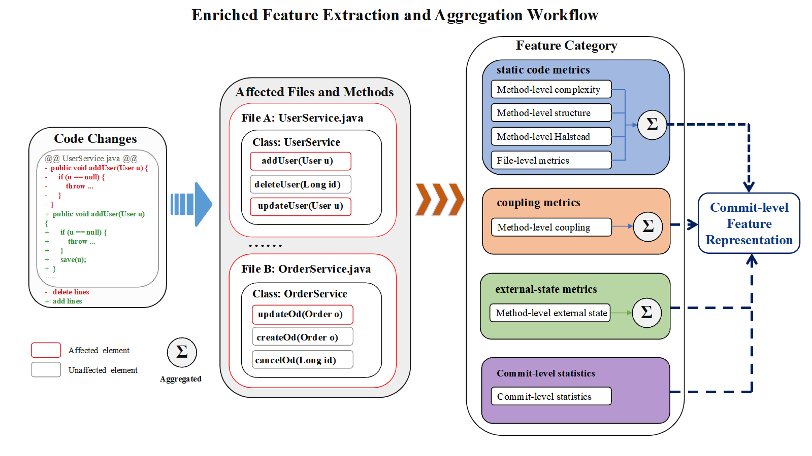

# JIT-SDP Feature Suite

A feature extraction framework for Just-In-Time Software Defect Prediction (JIT-SDP).

This repository provides an extensible pipeline for extracting commit-level expert features from software repositories. 
It extends the canonical 14 change metrics proposed by Kamei et al. with method-level and file-level software metrics.

### The figure below illustrates the enriched feature extraction and aggregation workflow.

